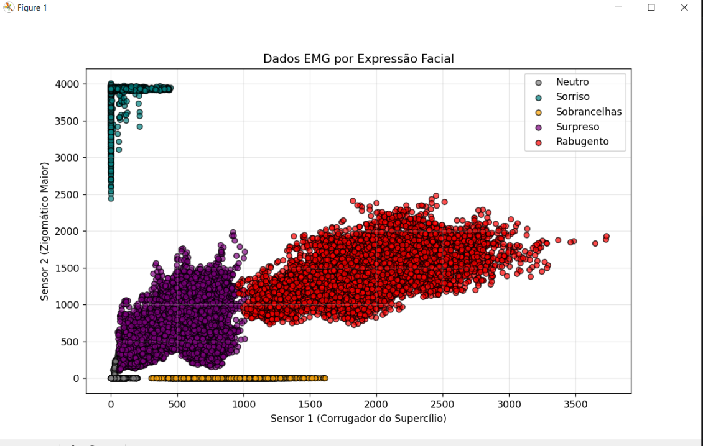
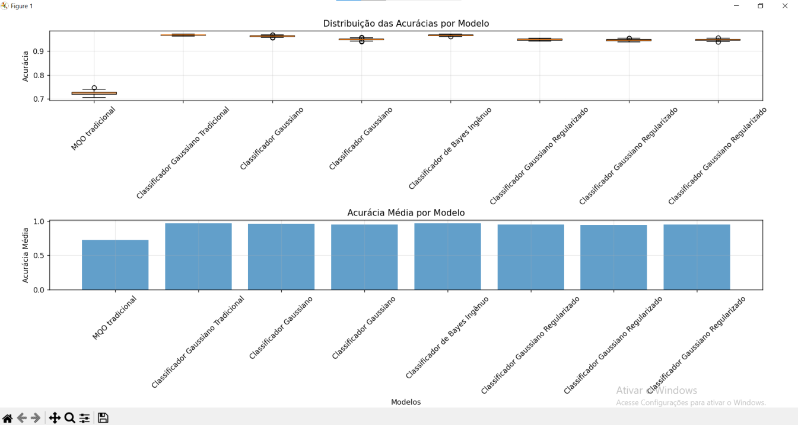
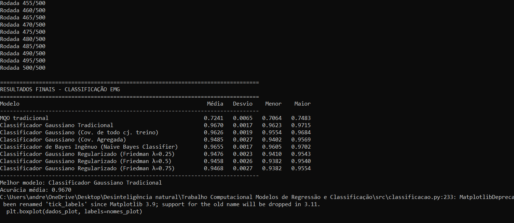

# Projeto de Inteligência Artificial – Regressão e Classificação

Este repositório apresenta a implementação de modelos de Inteligência Artificial supervisionados aplicados a duas tarefas distintas: **regressão** e **classificação**.  
O trabalho foi desenvolvido como parte da disciplina de Inteligência Artificial Computacional.

---

## 📌 Objetivos
- Implementar e comparar diferentes algoritmos de regressão para previsão da potência de um aerogerador com base na velocidade do vento.
- Desenvolver modelos de classificação para identificar expressões faciais a partir de sinais de EMG (eletromiografia).

---

## ⚙️ Metodologia

### 🔹 Tarefa 1 – Regressão
- **Dataset:** `aerogerador.dat` (velocidade do vento → potência gerada).
- **Modelos implementados:**
  - MQO Tradicional
  - MQO Regularizado (Ridge/Tikhonov)
  - Modelo de Média (baseline)

- **Validação:** Simulações de Monte Carlo (500 rodadas, 80% treino / 20% teste).
- **Métrica de avaliação:** Soma dos Desvios Quadráticos Residual (RSS).

**Exemplo de saída gráfica:**  
**Conjunto de dados do aerogerador:**  


**Modelos Ajustados (Dados de Treino) + Resíduos:**  


**Comparação Estatística dos Modelos (Monte Carlo):**  


**Resultados no Terminal:**  


---

### 🔹 Tarefa 2 – Classificação
- **Dataset:** sinais EMG dos músculos faciais (Corrugador do Supercílio e Zigomático Maior).
- **Classes analisadas:** neutro, sorriso, sobrancelhas levantadas, surpreso, rabugento.
- **Modelos implementados:**
  - MQO Tradicional
  - Classificador Gaussiano Tradicional
  - Classificador Gaussiano com Covariâncias Iguais
  - Classificador Gaussiano com Matriz Agregada
  - Classificador Gaussiano Regularizado (Friedman)
  - Classificador de Bayes Ingênuo

- **Validação:** Simulações de Monte Carlo (500 rodadas, 80% treino / 20% teste).
- **Métrica de avaliação:** Acurácia média, desvio-padrão, valor máximo e mínimo.

### 📷 Resultados Visuais

**Distribuição dos Dados EMG por Expressão Facial:**  


**Distribuição das Acurácias por Modelo:**  


**Resultados no Terminal:**  


---

---

## 📊 Resultados

### Regressão
- Os modelos lineares (MQO e Ridge) apresentaram resultados consistentes.
- O modelo de Média obteve desempenho significativamente inferior.

### Classificação
- Modelos Gaussianos Regularizados atingiram até **96,7% de acurácia média**.
- Bayes Ingênuo e Gaussiano com Covariâncias Iguais tiveram baixa performance.
- O MQO apresentou desempenho intermediário.

---

## 🏁 Conclusão
- **Regressão:** modelos lineares simples são eficazes para estimar a potência de um aerogerador.  
- **Classificação:** a regularização melhora significativamente a performance em sinais EMG.  
- Destaca-se a importância da escolha correta do algoritmo para cada tipo de problema.

---

## 📂 Estrutura do Repositório
```
├── data/ # Conjuntos de dados utilizados
├── src/ # Código-fonte dos modelos
├── results/ # Gráficos e resultados
└── README.md # Este arquivo
```


